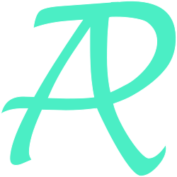

# Awesome Research Tools

A.R.T.，科研也可以是一种艺术。

[中文主页](https://les1ie.github.io/Awesome-research-tools/)

---

本项目旨在收集和整理一批有助于科研的工具和资源，并逐渐打造一个全面、好用、活跃的科研工具资源站点/社区。
希望它们能优化科研过程，提高科研的体验，让搞科研的过程更有艺术😊。

- 全面：涵盖尽可能多的学科和领域；
- 好用：项目中推荐的工具和资源尽量均为贡献者亲身体验过，并附带简短评价；
- 活跃：保持维护，不断更增加新内容、剔除过失内容。

欢迎结合自己的研究方向提 PR、Issue。
如果有长期缺乏维护的 paper list、library 或失效的链接、网站，敬请告知。

项目主页的使用Hugo部署，见[HUGO-README.md](HUGO-README.md)。

## Item Status

| 状态 | 描述 |
| :--- | :--- |
|  | 积极维护中，功能完整。 |
|  | 维护放缓，但仍具参考价值。 |
|  | 已停止维护，不建议使用。 |
|  | **完全免费**：开源项目或免费工具。 |
|  | **部分付费**：基础功能免费，部分功能需要付费或者订阅。 |
|  | **商业付费**：需购买授权或支付订阅费用才能使用。 |

## Contribute

- 最简单的贡献方法就是使用 [Issue](https://github.com/Les1ie/Awesome-research-tools/issues/new?assignees=Les1ie&labels=&projects=&template=issue-%E6%A8%A1%E6%9D%BF.md) 或 [Discussion](https://github.com/Les1ie/Awesome-research-tools/discussions/new/choose) 来留言。
- 如果想自己动手，主要步骤为：Fork → 编辑 Fork 的仓库 → 提交 Pull Request。

  本项目中的主要内容均放置在[conent/docs](conent/docs)目录内，每一类工具页面的源码对应一个子目录内的`index.md`。
  例如“阅读、笔记、写作”类工具的源码在[content/docs/reading/index.md](content/docs/reading/index.md)。

## Change Log

- 2026-09-12：修复 `
` 折叠分组失效（Hugo 默认剔除非安全原生 HTML，导致所有分组标签被丢弃）；补全 53 处缺失的价格徽章；为首屏过长的分类增加折叠分组；新增 Remio、Articlo。
- 2026-01-23：更新所有 item 的维护状态、优化表格展示
- 2024-07-01：使用 hugo 制作 github page。

## To Do

- [x] 设计并更新 logo 与主页背景图
